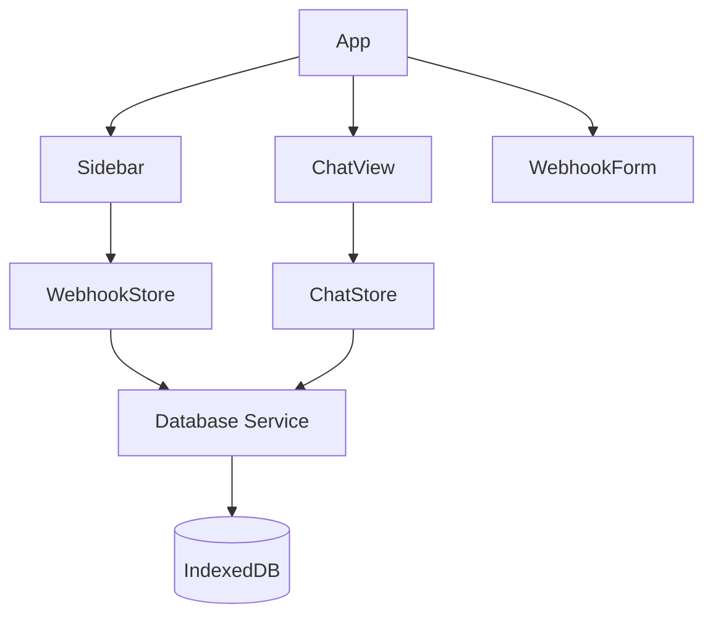

# WebhookUI

A React-based user interface for managing and interacting with webhooks, specifically designed to work with n8n webhook nodes. Built with TypeScript, Vite, and modern web technologies.

## Features

- 🔗 Manage webhooks with secure passphrase encryption
- 💬 Real-time chat interface for webhook interactions
- 📝 Chat history management with persistent storage
- 🔒 Secure data storage using IndexedDB
- 🎨 Modern UI with Tailwind CSS
- 🔐 JWT authentication support for n8n webhooks

## Architecture



## Prerequisites

- Node.js (v16 or higher)
- pnpm (recommended) or npm
- n8n instance with webhook nodes configured

## Installation

1. Clone the repository:
   ```bash
   git clone [repository-url]
   cd WebhookUI
   ```

2. Install dependencies:
   ```bash
   pnpm install
   ```

3. Create environment configuration:
   ```bash
   cp .env.example .env
   ```

4. Update the `.env` file with your configuration:
   ```env
   VITE_ENCRYPTION_KEY=your-secure-encryption-key
   ```
   This key is used to encrypt webhook passphrases in the local database.

## Development

Run the development server:
```bash
pnpm dev
```

The application will be available at `http://localhost:5173`

## Building for Production

1. Build the application:
   ```bash
   pnpm build
   ```

2. Preview the production build:
   ```bash
   pnpm preview
   ```

## Usage Guide

### Setting up a Webhook

1. Click the "+" button in the sidebar to add a new webhook
2. Fill in the webhook details:
   - Name: A unique identifier for your webhook
   - URL: The n8n webhook URL
   - JWT Passphrase: The secret key for JWT authentication

### n8n Webhook Configuration

1. In n8n, create a new Webhook node
2. Configure the webhook with:
   - Authentication: JWT
   - Key Type: Passphrase
   - Algorithm: HS256
   - Secret: Your chosen passphrase

### Using the Chat Interface

1. Select a webhook from the sidebar
2. Type your message in the input field
3. Press Enter or click the send button
4. The webhook response will appear in the chat

### Chat History

- Chat histories are automatically saved
- Access previous chats from the sidebar
- First message of each chat becomes its title
- Delete chat histories using the trash icon

## API Integration

### Request Format

```typescript
interface WebhookRequest {
  message: string;
  UUID?: number;  // Chat history ID
}
```

### Response Format

The application expects one of these response formats:

```typescript
// Array format
[{
  message: string;
  // or
  response: string;
}]

// Object format
{
  message: string;
  // or
  response: string;
}
```

## Security

- Webhook passphrases are encrypted before storage
- JWT authentication for secure webhook communication
- Environment variables for sensitive configuration
- Secure IndexedDB storage for chat history

## Project Structure

```
src/
├── components/          # React components
│   ├── Chat/           # Chat interface components
│   ├── Sidebar/        # Navigation and webhook list
│   └── WebhookForm/    # Webhook management form
├── services/           # Core services
│   └── database.ts     # IndexedDB database service
├── store/             # State management
│   ├── chatStore.ts    # Chat state and logic
│   ├── webhookStore.ts # Webhook management
│   └── chatHistoryStore.ts # History management
└── utils/             # Utility functions
```

## Contributing

1. Fork the repository
2. Create a feature branch
3. Make your changes
4. Run tests: `pnpm test`
5. Submit a pull request

### Code Style

- Follow TypeScript best practices
- Use JSDoc comments for documentation
- Follow the existing component structure
- Use meaningful variable and function names

## License

MIT License

Copyright (c) 2025 Andreas Popp <andi.popp42@gmail.com>

Permission is hereby granted, free of charge, to any person obtaining a copy
of this software and associated documentation files (the "Software"), to deal
in the Software without restriction, including without limitation the rights
to use, copy, modify, merge, publish, distribute, sublicense, and/or sell
copies of the Software, and to permit persons to whom the Software is
furnished to do so, subject to the following conditions:

The above copyright notice and this permission notice shall be included in
all copies or substantial portions of the Software.

THE SOFTWARE IS PROVIDED "AS IS", WITHOUT WARRANTY OF ANY KIND, EXPRESS OR
IMPLIED, INCLUDING BUT NOT LIMITED TO THE WARRANTIES OF MERCHANTABILITY,
FITNESS FOR A PARTICULAR PURPOSE AND NONINFRINGEMENT. IN NO EVENT SHALL THE
AUTHORS OR COPYRIGHT HOLDERS BE LIABLE FOR ANY CLAIM, DAMAGES OR OTHER
LIABILITY, WHETHER IN AN ACTION OF CONTRACT, TORT OR OTHERWISE, ARISING FROM,
OUT OF OR IN CONNECTION WITH THE SOFTWARE OR THE USE OR OTHER DEALINGS IN THE
SOFTWARE.

## Support

For issues and feature requests, please use the GitHub issue tracker.
